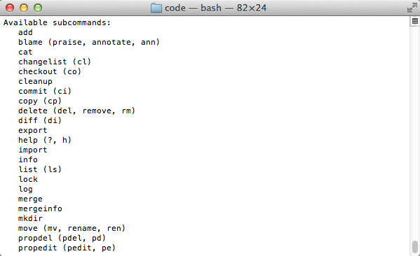

## 使用svn客户端功能

**1.从本地导入代码到服务器(第一次初始化导入)**

```
$ svn import /Users/apple/Documents/eclipse_workspace/weibo svn://localhost/mycode/weibo --username=mj --password=123 -m "初始化导入"
```

我解释下指令的意思：将`/Users/apple/Documents/eclipse_workspace/weibo`中的所有内容，上传到服务器`mycode`仓库的`weibo`目录下，后面双引号中的"初始化导入"是注释

 

**2.从服务器端下载代码到客户端本地**

```
svn checkout svn://localhost/mycode --username=mj --password=123 /Users/apple/Documents/code
```

我解释下指令的意思：将服务器中`mycode`仓库的内容下载到`/Users/apple/Documents/code`目录中

 

**3.提交更改过的代码到服务器**

在步骤2中已经将服务器端的代码都下载到`/Users/apple/Documents/code`目录中，现在修改下里面的一些代码，然后提交这些修改到服务器


````
//<1> 打开终端，先定位到/Users/apple/Documents/code目录
$ cd/Users/apple/Documents/code

//<2> 输入提交指令：
$ svn commit -m "修改了main.m文件"
````

这个指令会将`/Users/apple/Documents/code`下的所有修改都同步到服务器端，假如这次我只修改了`main.m`文件


**4.更新服务器端的代码到客户端**

这个应该是最简单的指令了，在终端中定位到客户端代码目录后，比如上面的`/Users/apple/Documents/code`目录

```
$  svn update
```

**5.至于svn的其他用法**

```
$ svn help
```

****

这里列出一大堆`svn`指令，后面括号中的内容的一般代表着指令的简称，比如我们可以用`svn ci`代替`svn commit`，用`svn co`代替`svn checkout`。